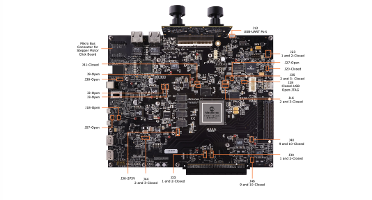

## Introduction

This solution is built around the CoreTSN IP, which implements the IEEE® 802.1Qbv Time-Aware Shaper (TAS) to ensure scheduled transmission of critical traffic with deterministic latency. In conjunction, the Core1588 IP supports Generalized Precision Time Protocol (gPTP) as per IEEE 802.1AS, enabling the system to synchronize its local clock to an external master with nanosecond-level accuracy.

The CoreTSN IP supports configurable traffic classes, gate control lists, and time-slot enforcement, providing the essential building blocks for deterministic Ethernet networks. It also supports advanced TSN features including Frame Preemption (IEEE 802.1Qbu/802.3br) and Per-Stream Filtering and Policing (PSFP – IEEE 802.1Qci).

This application note demonstrates how these capabilities can be evaluated and integrated using the PolarFire® SoC platform.


## Table of Contents

- [Introduction](#introduction)
- [Table of Contents](#table-of-contents)
- [Demo Design](#demo-design)
- [Demo Requirements](#demo-requirements)
- [Demo Prerequisite](#demo-prerequisite)
- [Demo Setup](#demo-setup)
  - [Jumper Settings and Board Setup](#jumper-settings-and-board-setup)
  - [Software Setup](#software-setup)
  - [Instructions to Run the Demo on Linux](#instructions-to-run-the-demo-on-linux)
    - [Demo at a glance](#demo-at-a-glance)
- [Design Resource Utilization](#design-resource-utilization)
- [Design Description](#design-description)
  - [Design Control Flow](#design-control-flow)
  - [Hardware Implementation](#hardware-implementation)
  - [Software Implementation](#software-implementation)
- [Programming the Device Using FlashPro Express](#programming-the-device-using-flashpro-express)
- [Appendix A: TSN Demo for Windows Support](#appendix-a-tsn-demo-for-windows-support)
- [Appendix B: Linux® Host Setup for Serial Communication](#appendix-b-linux-host-setup-for-serial-communication)
- [Appendix C: Verifying PTP Hardware Clock (PHC) Support](#appendix-c-verifying-ptp-hardware-clock-phc-support)
- [Appendix D: Design Creation Using TCL Scripts](#appendix-d-design-creation-using-tcl-scripts)
- [Glossary](#glossary)


## Demo Design

The demo design integrates the functionality of the TSN IP on a PolarFire® SoC Video kit. The TAS (Qbv) feature of TSN is demonstrated in this demo by controlling the stepper motor and the counter.

The design comprises of the MSS controlling the TSN IP and it schedules the stepper motor and the counter data as a high priority time scheduled traffic, to ensure timely delivery to the client. The design integrates the packet generator to generate the best-effort traffic. The time synchronization is achieved by using the Core1588 IP, which extracts and inserts the time stamp in the corresponding PTP packets received from the network. The line side serial interfaces uses the CoreSGMII IP to convert the Gigabit Media Independent Interface (GMII) to the Serial Gigabit Media Independent Interface (SGMII).

The following block diagram illustrates the block-level view of the current demo.

<div align="center">

<p><b>Figure 1-1</b> TSN IP Demo</p>
</div>

## Demo Requirements


| Requirement                  | Description                                                                                                                                                                                                                                         |
| :--------------------------- | :-------------------------------------------------------------------------------------------------------------------------------------------------------------------------------------------------------------------------------------------------- |
| **PolarFire® SoC Video Kit** | MPFS250-VIDEO-KIT. Includes:<br/>• PolarFire SoC Video Kit Board (MPFS250TS-1FCG1152I)<br/>• 4K30 Dual Camera Sensor with Sony IMX334s<br/>• HDMI cable<br/>• Micro B USB cables (2)<br/>• RJ45 Ethernet cable<br/>• 12V AC adapter, 12V power cord |
| **FMC Daughter Card**        | ETH-DC-DUALGBE                                                                                                                                                                                                                                      |
| **Host PC**                  | A host PC with USB, Ethernet port, and Linux/Ubuntu OS.                                                                                                                                                                                             |
| **Ethernet cable**           | Three Ethernet cables required to communicate with the PolarFire SoC Video Kit or PolarFire SoC ICICLE kit.                                                                                                                                         |
| **Network Switch**           | Generic Gigabit Ethernet Network Switch (Unmanaged), with power adapter.                                                                                                                                                                            |
| **Stepper 7 Click**          | Versatile driver for bipolar step motors featuring MTS62C19A Dual Full-Bridge Motor Driver and MCP23S08 I/O Expander. Requires 12V DC supply and female connector (not included).                                                                   |
| **Multi Stepper Motor**      | QMot.eu Stepper Motor, Part Number QSH 4218-35-10-027, Lot No. 1016062(1.001)A                                                                                                                                                                      |
| **Program Debug 2025.1**     | Executable for installing FlashPro Express 2025.1 to program the FPGA.                                                                                                                                                                              |
| **Putty/TeraTerm/Minicom**   | UART receiver-transmitter applications on the host PC.                                                                                                                                                                                              |
| **USBImager**                | Used to program a Linux image to target memory using Hart Software Services.                                                                                                                                                                        |
| **7-Zip**                    | Tool needed for extracting `.wic` file from `.wic.gz` compressed file.                                                                                                                                                                              |
| **Linux wic Image**          | `TSN_Demo_GUI_Video_Kit_WIC-Image.wic.gz`                                                                                                                                                                                                           |
| **Job File**                 | `TSN_Demo_GUI_Video_Kit.job`                                                                                                                                                                                                                        |
| **CoreTSN**                  | Licensed IP. For license details, see the CoreTSN User Guide.                                                                                                                                                                                       |

<!-- prettier-ignore-start -->

## Demo Prerequisite

Before you begin, download the programming job file and the Linux .wic image from: [AN5892](https://microchip.com/en-us/application-notes/an5892).

## Demo Setup

This section provides detailed information how to setup and run the demo.

### Jumper Settings and Board Setup

The following figure shows the board setup.

<div align="center">

<p><b>Figure 4-1</b> Board Setup showing Jumper Settings</p>
</div>

To setup the Video Kit board, perform the following steps:
1. Connect the RJ45 Ethernet cable to any one of the FMC Ethernet Port (J22) of the board and Ethernet network switch.
2. Ensure to make the required wire connections from Stepper Motor to the Click board, as shown in the following figure.

<div align="center">

<p><b>Figure 4-2.</b> Lead Wire Configuration</p>
</div>

1. Make sure to connect the 12V DC power adapter to the Click board (for more information, [see
this image](https://www.microchip.com/content/dam/mchp/mrt-dam/other-diagrams/fpga/gr-25-107685-250731-fpga-bnr-eth-dc-dualgbe-connection-800x377_r3.jpg)).

### Software Setup

Ensure you have an Ubuntu machine, an Ethernet network switch, and administrative privileges, and verify that the system meets the minimum requirements to set up the TSN demo.

Extract the .wic image and to proceed with flashing the image, see [Updating Linux in MPFS Kit](https://github.com/polarfire-soc/polarfire-soc-documentation/blob/master/reference-designs-fpga-and-development-kits/updating-linux-in-mpfs-kit.md#updating) (The instructions provided in the link are applicable to both the Icicle and Video Kit).


### Instructions to Run the Demo on Linux

To configure the network communication between Ubuntu and Video Kit, perform the following\ steps (these must be repeated every power cycle):

1. On Video Kit:
   <ol type="a">
     <li>Power on the TSN Video Kit, a login prompt appears. To configure the Linux host setup serial communication, see Appendix B: Linux Host Setup for Serial Communication.</li>
     <li>Enter the username as root with no password, and press enter.</li>
     <li>To check the IP address, enter ifconfig command. The IP address will not display, because the network device has not been initialized yet.</li>
     <li>Navigate to the `/opt/microchip/tsn/` folder and execute `./tsninit.sh` command. Upon successful execution of the script, the Demo Kit receives an IP address from the DHCP server (provided the server is operational and accessible). This script also configures a VLAN on the Demo Kit. The code snippet creates a VLAN interface eno1.13 on eno1, assigns the IP address 192.168.13.2, applies an egress QoS map (0:5), and sets the MTU to 1400 bytes. This setup enables isolated and prioritized network traffic within VLAN 13.</li>
   </ol>

<div align="center">

<p><b>Figure 4-3</b> Configuring VLAN on the Demo Kit</p>
</div>

2. On Ubuntu Machine: Log in to the Ubuntu machine and execute the following commands to
configure VLAN 13, and assigns the IP address to `192.168.3.20`.
 
 ```
 # TSN Demo configuration PCP 5 for VLAN 13
sudo ip link add link eno1 name eno1.13 type vlan id 13 egress-qos-map 0:5
sudo ip link set dev eno1.13 up
sudo ip addr add 192.168.13.20/24 dev eno1.13
sudo ifconfig eno1.13 mtu 1400
```
<br />

> [!IMPORTANT]
> If the network device is not named eno1, update the commands accordingly.


1. Once the network is configured, test connectivity to the TSN demo kit to by running ping
192.168.13.2 from the Ubuntu machine. Receiving replies confirms that the communication
path is working.

2. Then, on the demo kit, run ping 192.168.13.20 to test connectivity to the Ubuntu machine. If both ping tests succeed, the VLAN-based communication path is confirmed to be established.

3. For a PTP connection to function between an Ubuntu machine (acting as the initiator) and a PolarFire SoC device (acting as the target), ptp4l must be configured on both devices. Perform the following recommended instructions on Ubuntu machine:
    <ol type="a">
        <li>Verify that the Ubuntu system's Network Interface Card (NIC) supports Generalized Precision Time Protocol (gPTP). For more information, see [Appendix C: Verifying PTP Hardware Clock (PHC) Support](Verify that the Ubuntu system's Network Interface Card (NIC) supports Generalized Precision Time Protocol (gPTP). For more information, see Appendix C: Verifying PTP Hardware Clock (PHC) Support)</li>
        <li>Install the LinuxPTP package with `sudo apt-get install linuxptp` command</li>
        <li>Download the [gPTP.cfg](https://github.com/richardcochran/linuxptp/blob/master/configs/gPTP.cfg) and change the **neighborPropDelayThresh** value from 800 to
    150000, to ensure it aligns with the NIC configuration.</li>
        <li>Run the ptp4l initiator with `sudo ptp4l -i <eth interface> -m -f <path to gPTP.cfg> command`</li>
    </ol>


> [!NOTE]
>  ptp4l starts on the target (PolarFire SoC device) with the execution of the `tsninit.sh` script in Step 4.

> [!IMPORTANT]
> For Windows® support, see the [Appendix A: TSN Demo for Windows Support](#appendix-a-tsn-demo-for-windows-support).

#### Demo at a glance

To setup and run the demo, perform the following steps

1. Launch a web browser such as Chrome or Edge and navigate to [http://192.168.13.2/tsn/](http://192.168.13.2/tsn/). This displays the TSN demo kit's web page, as shown in the following figure.

<div align="center">

<p><b>Figure 4-4</b> PolarFire® SoC TSN Demo Page</p>
</div>

2. Clicking the **Counter** icon initiates a countdown timer on the demo kit, decrementing by one unit every second. While active, the web browser updates the displayed counter value in real-time by retrieving the latest value from the demo kit every second, providing a live view on the web page.
3. When the **Counter** icon is deactivated, the web browser stops retrieving and displaying the counter value from the demo kit, but the countdown timer continues to operate in the background on the demo kit.
4. Clicking the **Start Stepper Motor** icon initiates continuous operation of the stepper motor, by changing the icon label to **Stop Stepper Motor**. The system then sends commands every second for the motor to complete a full revolution. This process continuous until the **Stop Stepper Motor** icon is pressed, which stops the motor.

<div align="center">

<p><b>Figure 4-5.</b> Starting and Stopping the Stepper Motor</p>
</div>
5. When the **Flood Traffic** icon is pressed, it starts the flood traffic at a very high rate. This traffic is pre-configured to run for 15 seconds and stops automatically. It cannot be stopped manually.

> [!IMPORTANT]
> Ensure to run this setup on an isolated network to avoid interference with other systems. TSN is designed to handle and prioritize specific traffic patterns that might not align with standard network configurations.

<div align="center">

<p><b>Figure 4-6</b> Initiating Flood Traffic</p>
</div>

1. To configure the demo kit with the default TSN profile, click the TSN icon. When TSN is enabled, a specific portion of the network bandwidth is reserved for motor control commands and counter data updates, ensuring deterministic and time-critical communication. This is managed using the Time-Aware Shaper (TAS), which divides the communication cycle into specific time slots and schedules critical messages to be sent exclusively during these windows. TAS temporarily restricts lower-priority traffic, ensuring that essential messages are delivered on time and without interference, maintaining real-time synchronization for motor controls and counter updates.
<div align="center">

<p><b>Figure 4-7</b> Configuring the Demo Kit with the Default TSN Profile</p>
</div>

1. Deactivating the **TSN** icon removes the TSN profile from the demo kit, enabling dynamic switching between TSN-enabled and standard network modes for flexible configuration and testing.

The demo uses a Click board to control the stepper motor, interfacing with the FPGA over SPI. The SPI driver exposes control signals from the Click board, allowing the motor to be operated by sending data over SPI. Similarly, if other interfaces such as I2C are needed, ensure the appropriate drivers are available and can communicate with the FPGA to control the target device.


## Design Resource Utilization

The following table lists the resource utilization of the TSN demo on PolarFire® SoC MPFS250TS. These values might vary slightly for different Libero® runs, settings and seed values.

<div>
  <p align="center"><b>Table 5-1</b> Resource Utilization</p>

  | Module Name                | 4LUT (Fabric & Interface) | DFF (Fabric & Interface) | µSRAM (64x12) | LSRAM (20K) |
  | -------------------------- | :-----------------------: | :----------------------: | :-----------: | :---------: |
  | CORERESET_PF_C0_0          |             1             |            17            |       0       |      0      |
  | CORERESET_PF_C1_0          |             1             |            17            |       0       |      0      |
  | CORE1588_C0_0              |           3450            |           2686           |       0       |      0      |
  | COREAXI4PROTOCONV_C0_0     |           1161            |           933            |       9       |      1      |
  | COREAXI4PROTOCONV_C1_0     |           1171            |           1032           |       8       |      1      |
  | CORESGMII_C0_0             |           1950            |           994            |       0       |      0      |
  | CORETSN_C0_0               |           20654           |          22074           |       0       |     121     |
  | CoreAXI4SInterconnect_C0_0 |            55             |            6             |       0       |      0      |
  | DMA_INITIATOR_0            |           2602            |           2245           |      27       |      0      |
  | FIC0_INITIATOR_0           |           11085           |           6613           |      28       |     10      |
  | NAT_STR_CONV1_0            |             4             |            1             |       0       |      0      |
  | PF_IOD_CDR_C0_0            |            243            |            59            |       0       |      0      |
  | PF_IOD_CDR_CCC_C0_0        |            30             |            31            |       0       |      0      |
  | PF_XCVR_ERM_C0_0           |             0             |            0             |       0       |      0      |
  | STR_NAT_CONV_0             |             7             |            38            |       0       |      0      |
  | pckt_generator_checker_0   |           1300            |           559            |       0       |      0      |
  | CoreAPB3_C0_0              |            125            |            0             |       0       |      0      |
  | MSS                        |             0             |            0             |       0       |      0      |

</div>

## Design Description

The TSN Demo with GUI involves setting up an Ubuntu machine with VLAN configurations and deploying the Video Kit by installing the WIC image and job file. Once the network is configured, connectivity between the Ubuntu machine and the TSN Demo Video Kit is verified. The demonstration consists of the following phases:

1. Basic Functionality Check:
    - The demo webpage is accessible through a browser.
    - The counter initiates, displaying a decrementing count.
    - Halting the counter stops its status updates.
    - The stepper motor is controlled through the GUI.
2. Time Scheduling:
    - The time aware shaper of the TSN functionality is demonstrated by initiating the flood traffic, during this the counter and stepper motor control data generated by the MSS are placed on the line the unspecified intervals as the time aware shaper is not enabled by the MSS.
    - This results in the intermittent or paused updates of the counter status and the operation of the stepper motor is impacted. When the flood traffic is stopped the counter and motor resumes the normal operation.
    - The MSS enables the TSN time scheduling by sending the motor and counter data as high priority frames in a time scheduled manner by configuring the Gate control list and enabling the priority gates in the required intervals. The best-effort traffic is sent during the times when the priority traffic is not present.
    - This configuration results in the uninterrupted counter updates and the continuous operation of the stepper motor even when the flood traffic is active.

This demonstrates the efficiency of the TSN in the real time transmission without interruptions.

### Design Control Flow

This section provides detailed information on control interfaces.

AXI4-Lite Interface: This interface configures the descriptors of the memory mapped IP's S2MM and MM2S. The same interface configures the registers and read the status of the corresponding IP's.

APB Interface: This interface configures the internal registers and read the status of CoreTSN, Core1588 and Packet generator modules. It connects to the CORETSN, CORE1588 and packet generator modules. It configures and reads the status information from these modules.


### Hardware Implementation

The following are the Libero SmartDesign modules of the demo design:

* Clock and Reset Module
* APB Module
* Processor Subsystem
* TSN Peripheral Module

#### Clock and Reset Module

This SmartDesign module generates the necessary clocks and resets for the system. It produces three clocks: the AXI_CLK of 125 MHz and APB Clock of 50 MHz, both generated using a Clock Conditioning Circuit (CCC) with a reference clock of 125 MHz. Additionally, the I2C Clock of 1 MHz is derived from an internal 2 MHz oscillator, utilizing a clock divider module set to a division factor of 2. This module also includes the INIT monitor and the reset circuitry for the 125 MHz and 50 MHz clocks.

The AXI_CLK is used as the system side clock in the design and the APB logic of all the connected IP's in the design operate with the APB Clock.

The following figure shows the SmartDesign of the clock and reset module.

<div align="center">

<p><b>Figure 6-1</b> SmartDesign of the Clock and Reset Module</p>
</div>

#### APB Module

The following figure shows the SmartDesign of the APB module.

<div align="center">

<p><b>Figure 6-2</b> SmartDesign of the APB Module</p>
</div>

This SmartDesign includes an APB Interconnect module that links the APB Initiator interface from the processor subsystem module to various APB Targets in the demo design. The target devices in the design with APB control interface are connected as through this interconnect. The MSS accesses
the internal registers and control status of the various targets through this interface. If the user wants to add any other module to the demo with APB control interface, it has to be connected through this interconnect module as an additional target device.

#### Processor Subsystem

The following figure shows the SmartDesign of processor subsystem module.

<div align="center">

<p><b>Figure 6-3</b> SmartDesign of Processor Subsystem Module</p>
</div>

The PolarFire® SoC MSS Configurator provides a GUI that allows embedded software engineers
to define the MSS start-up state efficiently. It generates an XML file initialization constructs and
outputs a CXZ file for integration into the Libero design flow. The CXZ file contains metadata and
port information required by the FPGA designer to complete the MSS and FPGA fabric connectivity.
The MSS Configurator is available as a stand-alone application and as part of the Libero SoC design
tool suite. The required interfaces of the MSS has to be configured using this configurator. The MSS
connects to the fabric modules through the FIC interfaces ( FIC_0_AXI4_intiator).

#### TSN Peripheral Module

The following figure shows the SmartDesign of TSN peripheral module.

<div align="center">

<p><b>FFigure 6-4</b> SmartDesign of TSN Peripheral Module</p>
</div>

This SmartDesign shows the interconnection of the CoreTSN IP to the system-side and the line- side. The system-side interface is connected to the AXI4 interface, while the line-side interface is connected to the onboard PHY module through a serial data interface operating at 1 Gbps.

##### COREAXI4PROTOCONV

This design includes two instances of the COREAXI4PROTOCONV IP: MM2S on the transmit side and S2MM on the receive side. The MSS transmits and receives data from the fabric modules as a memory mapped device. The TSN IP accepts and outputs data in AXI stream format which has to be read/written to the memory as per the descriptors configured by the MSS. This functionality is attained by the S2MM and M2SS Logic.

- **Transmit Operation**
This module implements the AXI4-Memory Mapped initiator read channel interface. This module reads the data to be transmitted from memory based on descriptors configured by the MSS. The retrieved data is then transmitted to the CoreTSN IP through the AXI4-Stream Initiator Interface (AXI4S_INIT).

- **Receive Operation**
This module implements the AXI4-Memory Mapped initiator write channel interface. Data received on the AXI4-Stream target interface is written to memory according to descriptors configured by the MSS.

##### CoreAXI4InterConnec

This IP provides AXI4 and AXI4-Lite interfaces and connects them with MSS through FIC interface. The AXI4 Crossbar connects one or more AXI4 memory-mapped initiators to one or more memory mapped targets. The demo design includes two instances of this IP:

1. One instance of this IP connects the AXI4 initiator interfaces of the S2MM and M2SS module to the MSS AXI4 target interface.
2. The other interface connects the MSS AXI4 initiator interface to the S2MM and M2SS AXI4 Lite target interface. This interface serves as the control interface of this IP's.= If the user want to add any fabric logic with AXI4 Lite Control interface or any memory mapped device with AXI4 interface it has to be connected to the MSS through this interconnect IP Block.

##### PCKT_GENERATOR_CHECKER

To create the traffic in the channel the demo design uses this module which can generate both Ethernet and VLAN tagged Ethernet packets. The traffic generated by this module is used as the best-effort traffic in the design. If required, you can replace this block with their own traffic generator Logic. The packets generated by this module are in native format.

##### NAT_STR_CONV

This module is responsible for converting the incoming native format packets to the AXI4-Stream interface. 

The packet generator generates data in native format whereas the TSN IP accepts the input in AXI4-Stream format. The conversion from Native to AXI4-Stream is done by this logic. If you replace the traffic generator capable of generating traffic in AXI4 stream format, this module can be removed from the design.

##### CoreAXI4SInterconnect

This IP connects the MSS AXI4-Stream interface and best-effort traffic generator stream interface to the TSN IP AXI4 target interface. The CoreInterconnect functions as a AXI4-Stream Switch. There are two AXI4-Stream Initiators, Priority traffic is generated from the MSS, while best-effort traffic is generated from the packet generator. The combined traffic is then connected to the AXI4S0_TRGT interface of the CORETSN IP

##### CoreTSN
The CoreTSN IP is responsible for transmitting both priority traffic and best-effort traffic to the line side at scheduled intervals. Priority traffic is assigned a higher priority than best-effort traffic and is written to higher priority queues. Data from these queues is sent to the line side at scheduled times when the corresponding queue gates are open, as configured by the MSS in the Gate Control List (GCL) of the IP. The IP uses an APB interface for control and an AXI4-Stream interface for data transfer.

The TSN also supports preemption feature wherein the best-effort traffic is fragmented and the channel is made available for the high priority traffic, fragmentation of best-effort packet takes place when the high priority packet is scheduled on the line and the best-effort traffic transmission is ongoing. The rest of the best-effort traffic packet is sent as the other fragment after the high priority packet is transmitted.


##### Core1588

Core1588 provides hardware support for the IEEE 1588 Precision Time Protocol (PTP) capable system. The core timestamps both the receipt and transmission of PTP event message frames. The MSS accesses these PTP timestamps through the APB interface of this IP.

##### CoreSGMII

CoreSGMII provides a solution for Ten-Bit Interface (TBI) on GMII based designs. CoreSGMII supports auto-negotiation between two link partners by exchanging their capabilities. This IP handles the encoding and decoding between GMII and SGMII formats, converting standard GMII signals to the 10-bit SGMII symbol format and vice versa. Since the external onboard PHY is SGMII PHY, this IP is required. If the user has GMII PHY, then this IP is not required.

##### PF_TX_PLL

The jitter attenuator PLL aligns the PTP clock with the local clock. The software synchronizes the initiator and target clocks by adjusting the TX PLL, specifically by modifying the integer and fractional divider values. The synchronized clock is then used for timestamping the PTP packets. The output clock from this module is used as the PTP clock in the design.

##### PF_IOD_CDR

This is a 1 Gbps data interface that operates with a 10:1 serialization ratio, providing 10-bit data on both the transmit and receive interfaces. The block converts parallel data into a serial data stream, which is transmitted through TX_P and TX_N. On the receive side, the interface includes a clock recovery block that generates the recovered clock (RX_CLK_R) and outputs the parallel data on RXD[9:0].

PF_IOD_CDR_CCC: This PF_IOD_CDR_CCC generates high-speed clocks with four phases: 0, 90, 180 and 270 degrees. These phase-shifted clocks are utilized by the PF_IOD_CDR module for clock recovery.

#### Clocking and Reset Structure

The following are the three clock domains in the demo design:

* Reference Onboard Clock 125 MHz: This clock is used for transceiver operation and as the reference clock for the CCC module. It generates the AXI interface clock of 125 MHz and the APB clock of 50 MHz. The transceiver module outputs a PTP_CLK signal at 125 MHz.

* Internal Oscillator: This oscillator generates a 2 MHz clock frequency. A clock divider divides this frequency by 2, resulting in a 1 MHz output. This 1 MHz output is used as the I2C clock.

* REF_CLK_IOD_CDR: The line side clocks in the design are derived from this reference clock using the IOD_CDR_CCC block. The TX clock generated by the IOD_CDR_CCC is used as the line side transmit clock and is connected CoreSGMII module. The IOD_CDR Block has clock recovery functionality and generates recovered clock and data. This recovered clock is used as the line side receive clock.


The following diagram shows the clocking structure of the TSN demo.

<div align="center">

<p><b>Figure 6-5</b> Clocking Structure</p>
</div>

There are two resets used in the design. One is ARESETN_125 MHz, which resets the logic operating at a 125 MHz clock. The other is ARESETN_50 MHz, which resets the logic with the APB clock (50 MHz). The IOD_CDR_CCC PLL_Lock is used to reset the IOD_CDR block.

The following block diagram shows the reset structure of the TSN demo.

<div align="center">

<p><b>Figure 6-6</b> Reset Structure</p>
</div>

#### Design Memory Map

The following figures show the memory map of the TSN demo design.

<div align="center">

<p><b>Figure 6-7</b> Memory Map of FIC_0_PERIPEHERALS</p>
</div>

<div align="center">

<p><b>Figure 6-8</b> Memory Map of FIC_CONVERTER</p>
</div>

### Software Implementation

The following figure shows the software implementation.

<div align="center">

<p><b>Figure 6-9</b> Software Implementation</p>
</div>


The TSN Demo Linux Software Stack comprises of kernel modules, frameworks, and user-space applications, operating within the MSS of PolarFire® SoC device. It integrates the necessary open-source components to meet specific functional and design requirements. The TSN Drivers Subsystem is responsible for configuring of CoreTSN and CoreAXI4ProtoConv IPs, Ethernet-PHY and the network device. It also abstracts these functionalities for access from Linux user space.

Within this subsystem, the Network Device Driver enables user-space applications such as ethtool, ifconfig and iperf through ethx (eth1) in this demonstration. It utilizes CoreAXI4ProtoConv to facilitate data transfer between the Fabric and MSS subsystems.

The CoreTSN Stack provides a user-space CLI for configuring the TSN features in accordance with IEEE 802.1 Qbv and Qbu standards. The CoreTSN Driver processes configuration requests from user-space applications to set up the TSN hardware. TSN operation relies on PTP (IEEE 1588) to achieve precise clock synchronization at sub-microsecond or nanosecond accuracy between the initiator and the PolarFire SoC device. The Core1588 Driver serves as the PTP driver, accessible at `/dev/ptpx`, and can be utilized by the LinuxPTP (ptp4l) application. A custom PI Controller within the PTP Apps ensures the required level of clock synchronization.

In the TSN Demo Solution, IP's are configured with default values using dedicated applications. Configuration parameters are transmitted to the PolarFire SoC Fabric layer through Linux kernel frameworks and the drivers subsystem. Once TSN is enabled through the GUI, data packets are exchanged between the software and Fabric layers and the external network.

## Programming the Device Using FlashPro Express

Connect a micro-USB to the Video Kit (J5) from the host PC and launch the FlashPro Express tool from the installation directory. Ensure that the jumper J28 is closed on the Video Kit. For detailed information about how to program the device using FlashPro Express, see [FlashPro Express User Guide](https://ww1.microchip.com/downloads/aemDocuments/documents/FPGA/swdocs/libero/flashpro_express_ug_2025_1.pdf).

## Appendix A: TSN Demo for Windows Support

By default, Windows® does not offer built-in VLAN tagging configuration through its standard network settings. Many Ethernet drivers do not display VLAN options in their User Interface (UI). To enable VLAN tagging (802.1Q) on Windows, specific driver configurations or command-line steps are required.

Requirements for configuring the TSN demo for windows are:

* Windows machine (Laptop/Desktop) with USB Port
* Windows PowerShell with Admin privileges
* USB Ethernet Adaptor (Realtek)

To configure VLAN ID 13 and to set Priority Code Point (PCP) to 5 on the Ethernet adapter of a Windows machine, perform the following steps. It enables VLAN tagging, assigns a static IP (`192.168.13.13`), and sets the MTU to `1400` to accommodate VLAN headers. A QoS policy is also applied to mark traffic with PCP 5 for priority handling on VLAN-aware networks.

1. Open PowerShell as an administrator and run ipconfig command
  ```console
  C:\Windows\System32\> ipconfig
  ```

Please note down all the interfaces listed. Ethernet and Ethernet 4 are listed, as shown in the following figure

<div align="center">

<p><b>Figure 8-1</b> IP Config Command</p>
</div>

2. Now connect the USB Ethernet Adapter into the laptop/desktop without having ethernet cable connected to the adapter.
3. Check the interfaces again by running ipconfig command. The new Ethernet port gets listed as "Ethernet 5", could be a different name in your case. Since the network is not connected yet, Media disconnected will be listed as shown in the following figure.

<div align="center">

<p><b>Figure 8-2</b> Verifying Ethernet Interface Name and IP Configuration</p>
</div>

4. Insert the network cable into the USB.
5. If you enable the DHCP, an IP Address will be assigned to this adapter automatically, as shown in
the figure

<div align="center">

<p><b>Figure 8-3</b> Automatic IP Assignment through DHCP on Adaptern</p>
</div>

6. To create VLAN/PCP, run the listed commands in PowerShell which configures the Ethernet 5, for PCP 5 and VLAN ID 13.

<div>
  <p align="center"><b>Table 5-1</b> Resource Utilization</p>

| **Task**                  | **Command**                                                                                              | **Remarks**                                                                                                    |
| ------------------------- | -------------------------------------------------------------------------------------------------------- | -------------------------------------------------------------------------------------------------------------- |
| Check Advance Properties  | `Get-NetAdapterAdvancedProperty -Name "Ethernet 5"`                                                      | —                                                                                                              |
| Enable VLAN/PCP Tagging   | `Set-NetAdapterAdvancedProperty -Name "Ethernet 5" -RegistryKeyword "*PriorityVLANTag" -RegistryValue 3` | Enables 802.1Q VLAN tagging and prioritization by setting the registry flag for VLAN/PCP tagging to 3.         |
| Set VLAN ID 13            | `Set-NetAdapterAdvancedProperty -Name "Ethernet 5" -RegistryKeyword "RegVlanID" -RegistryValue 13`       | Assigns VLAN ID 13 to the Ethernet interface, marking traffic from this interface with the specified VLAN tag. |
| Assign PCP                | `New-NetQosPolicy -Name "VLAN_Priority5" -AppPathNameMatchCondition "*" -PriorityValue8021Action 5`      | Creates a QoS policy to tag outbound packets (`AppPathNameMatchCondition "*"`) with a PCP value of 5.          |
| Assign IP Address to VLAN | `New-NetIPAddress -InterfaceAlias "Ethernet 5" -IPAddress "192.168.13.13" -PrefixLength 24`              | Sets a static IP address (`192.168.13.13/24`) on the interface.                                                |
| Set MTU to 1400           | `netsh interface ipv4 set subinterface interface="Ethernet 5" mtu=1400 store=persistent`                 | Reduces MTU to 1400 bytes to accommodate VLAN headers.                                                         |

</div>

  - To check advance properties, run the following command:
    

```console
Get-NetAdapterAdvancedProperty -Name "Ethernet 5"
```

**Priority & VLAN** status is **Disabled**, with registered value as "0", as shown in the following figure.

<div align="center">
    
    <p><b>Figure 8-4</b> Checking Priority & VLAN Status on Ethernet 5 Adapter (Disabled)</p>
</div>

- To enable VLAN/PCP tagging, run the following command:
  
    ```console
    Set-NetAdapterAdvancedProperty -Name "Ethernet 5" -RegistryKeyword "*PriorityVLANTag" -RegistryValue 3
    ```

**Priority & VLAN** status is changed to **Enabled**, with registered value as "3", as shown in the
following figure.

<div align="center">
    
    <p><b>Figure 8-5</b> Enabling Priority & VLAN on Ethernet 5 Adapter</p>
</div>

  - To set VLAN ID 13, run the following command:
  
    ```console
    Set-NetAdapterAdvancedProperty -Name "Ethernet 5" -RegistryKeyword "RegVlanID" -RegistryValue 13
    ```
    **VLAN ID** is changed to 13,with RegisteryValue as "13", as shown in the following figure.

    <div align="center">
        
        <p><b>Figure 8-6</b> Change VLAN ID to 13 on Ethernet 5</p>
    </div>

  - To assign PCP, run the following command as shown in the following figure.
    
    ```console
    New-NetQosPolicy -Name "VLAN_Priority5" -AppPathNameMatchCondition "*" -PriorityValue8021Action 5
    ```
    
    <div align="center">
        
        <p><b>Figure 8-7</b> Creating QoS Policy with VLAN Priority 5</p>
    </div>

    > [!NOTE]
    > Priority Value has been set to "5".

    - To assign IP address to VLAN, run the following command as shown in the following figure.
    ```console
    New-NetIPAddress -InterfaceAlias "Ethernet 5" -IPAddress "192.168.13.13" -PrefixLength 24
    ```
    <div align="center">
        
        <p><b>Figure 8-8</b> Assigning Static IP to Ethernet 5 Interface</p>
    </div>

    > [!NOTE]
    > Address has been set to "Ethernet 5".

    - To set MTU to 1400, run the following command as shown in the following figure.
    ```console
    netsh interface ipv4 set subinterface interface="Ethernet 5" mtu=1400 store=persistent
    ```
    <div align="center">
        
        <p><b>Figure 8-9</b> Setting MTU on Ethernet 5 Interface</p>
    </div>

    > [!NOTE]
    > Check the MTU for Ethernet 5 has been updated to 1400.
    
    - Run the `ipconfig` again and verify if the address `192.168.13.13` has been assigned to the "Ethernet 5" adaptor, as shown in the following figure.
    - 
    <div align="center">
        
        <p><b>Figure 8-10</b> Verifying IP Assignment on Ethernet 5 Adapter</p>
    </div>

    - To verify the connection to the PolarFire® SoC Video Kit, execute the command `ping 192.168.13.2`. Ensure that you receive a reply from the video kit, as shown in the following figure.
    - 
    <div align="center">
        
        <p><b>Figure 8-11</b> Ping Command to Verify Connection with PolarFire SoC Video Kit</p>
    </div>
    This confirms that communication between the Video Kit and the Windows machine is established and operational and to proceed further, see the [Demo at a Glance](#demo-at-a-glance) section.

The set up is tested on the listed source of OS:

    - OS Name: Microsoft Windows 11 Enterprise
    - OS Version: 10.0.22631 N/A Build 22631

## Appendix B: Linux® Host Setup for Serial Communication

To connect your Ubuntu PC to the Video Kit using a USB-to-UART cable and Minicom, perform the following steps:
1. Identify the Serial Port:
    a. Connect the Video Kit (J12) to the Ubuntu PC through the USB-to-UART cable.
    b. Open a Terminal.
    c. Before plugging in, check for any connected serial devices by running the `ls /dev/ttyUSB*` command (It is normal, if no devices are listed). 
    d. Plug in the cable and wait a few seconds. Then, run the command again: `ls /dev/ttyUSB*`. You must see a new device, such as `/dev/ttyUSB0`.
2. Install Minicom (if it is not already installed), using the following command(s):
```console
sudo apt update
sudo apt install minicom
```
3. To connect and configure with Minicom, you can use one of the two following approaches:
    - Single Terminal, Sequential Method:
        i. Start Minicom setup with the command sudo minicom -s.
        ii. In the **setup** menu, configure the serial device by selecting following options:
            1. A: Set Serial Device (start with, such as `/dev/ttyUSB0`)
            2. E: Set Baud Rate/Parity/Data Bits (use 115200 8N1)
            3. F: Hardware Flow Control as "No"
            4. G: Software Flow Control as "No"
        iii. Save as default (**Save setup as dfl**), then exit setup.
        iv. Launch Minicom using sudo minicom command.
        v. Look for a **root login prompt**, an output from the Video Kit. If the prompt is not visible, exit Minicom (**Ctrl+A**, then **Z**, then **X**), repeat steps from a-d using the next device (`/dev/ttyUSB1, /dev/ttyUSB2, /dev/ttyUSB3`) until the correct port is found.
    - Multiple Terminals Method: Open four separate terminals and run each command in a different terminal.
    ```console
    sudo minicom -b 115200 -o -D /dev/ttyUSB0
    ```
    ```console
    sudo minicom -b 115200 -o -D /dev/ttyUSB1
    ```
    ```console
    sudo minicom -b 115200 -o -D /dev/ttyUSB2
    ```
    ```console
    sudo minicom -b 115200 -o -D /dev/ttyUSB3
    ```
    Observe each terminal; use the one where you see the Video Kit’s output or login prompt.
4. To exit Minicom, press **Ctrl+A**, then **Z** and then **X**.

Once communication between the Video Kit and Linux is established, see the [Instructions to Run the Demo on Linux section](#instructions-to-run-the-demo-on-linux).

## Appendix C: Verifying PTP Hardware Clock (PHC) Support
To confirm if the NIC supports gPTP, check for a PHC using `ethtool`. Execute the `ethtool -T` command followed by the network interface name (for example, `eno1`), and then pipe the output to `grep PTP: ethtool -T [your_interface_name] | grep PTP`.

The following example shows how to verify PHC support:

Run `ethtool -T eno1 | grep PTP` and look for a line in the output similar to: `PTP Hardware Clock: x` (where x is a numerical value like `0`, `1` or `2`). The presence of this line indicates that NIC has a dedicated PHC, which is essential for gPTP's hardware timestamping and precise synchronization. if the PTP Hardware Clock is present, it confirms that NIC card supports gPTP. For information about PTP connection, see the Step 8 of "Instructions to Run the Demo on Linux" section.

## Appendix D: Design Creation Using TCL Scripts

TCL scripts are provided in the [GitHub Repository](https://github.com/polarfire-soc/polarfire-soc-video-kit-reference-design). Download the repository `polarfire-soc-video-kit-reference-design` and unzip it into a local directory.

To run the TCL, perform the following steps:

1. Launch the Libero SoC software.
2. Click **Project** > **Execute Script...**
3. Click **Browse** and in the downloaded `polarfire-soc-video-kit-reference-design` directory, select MPFS_VIDEO_KIT_REFERENCE_DESIGN.tcl and pass the argument `TSN SYNTHESIZE PLACEROUTE VERIFY_TIMING HSS_UPDATE SPIFLASH_DATA EXPORT_FPE`.
4. Click **Run**.
After successful execution of TCL script, Libero project is created within `polarfire-soc-video-kit-reference-design` directory. For more information about TCL scripts, see [GitHub Repository](https://github.com/polarfire-soc/polarfire-soc-video-kit-reference-design). For more details on TCL commands, see [Libero SoC TCL Command Reference Guide](http://coredocs.s3.amazonaws.com/Libero/2021_3/Tool/libero_soc_tcl_cmd_ref_ug.pdf). Contact [Technical Support](https://www.microchip.com/en-us/support) for any queries encountered when running the TCL script.


## Glossary

Following are the list of terms and definitions used in the document.

<div>
  <p align="center"><b>Table 12-1</b> Terms and Definitions</p>
  
|  **Term** | **Definition**                             |
| --------: | ------------------------------------------ |
|   **APB** | Advanced Peripheral Bus                    |
|  **AXI4** | Advanced eXtensible Interface 4            |
|  **FPGA** | Field-Programmable Gate Array              |
|   **GUI** | Graphical User Interface                   |
|  **MM2S** | Memory Mapped to Stream                    |
|   **MSS** | Microprocessor Subsystem                   |
|   **PTP** | Precision Time Protocol                    |
|   **RTL** | Register-Transfer Level                    |
|  **S2MM** | Stream to Memory Mapped                    |
| **SGMII** | Serial Gigabit Media Independent Interface |
|   **SoC** | System on Chip                             |
|   **TCL** | Tool Command Language                      |
|   **TSN** | Time-Sensitive Networking                  |
|  **VLAN** | Virtual Local Area Network                 |


</div>
